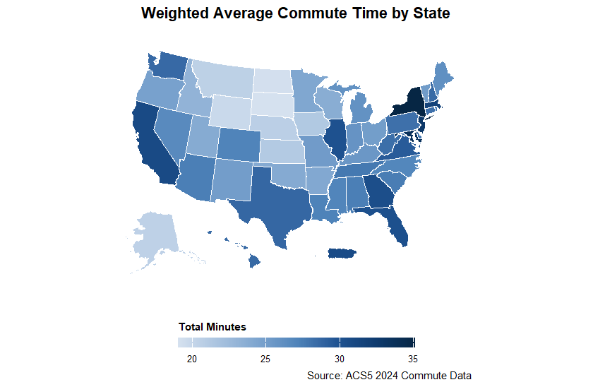

## ACS Mapping Demonstration

This repository contains demo materials, code examples, and resources from a public presentation on connecting to and mapping American Community Survey (ACS) data in R. The goal is to help R users access Census data, create informative maps, and build confidence working with spatial data.

You can request a [Census API key here.](https://api.census.gov/data/key_signup.html) This is required for all data calls, learn more through the Census [resource library.](https://www.census.gov/library/video/2026/adrm/requesting-a-census-data-api-key.html)

## Opening this Project

- Download or clone this repository
- Open acs-mapping.Rproj
- Open the files from within the RStudio project, starting with setup

## Repository Structure

| Folder | Purpose |
|---|---|
| setup/ | Start here to install your packages and set your API key |
| demos/ | Live presentation and demo scripts for the webinar |
| examples/ | Reusable example scripts to explore ACS data and Census geographies on your own |

## Topics Covered

- Accessing ACS data with `tidycensus`
- Downloading shapefiles with `tigris`
- Joining data and geometry
- Creating choropleth maps using different geometries
- Styling maps with `ggplot2`
- Exploring demographic and socioeconomic patterns

## The included examples focus on practical, reproducible workflows using:

- The [tidycensus package](https://walker-data.com/tidycensus/) and [book Methods, Maps, and Models in R](https://walker-data.com/census-r/) for Census [data](https://data.census.gov/).
- The [tigris package](https://github.com/walkerke/tigris) for Census [shapefiles](https://www.census.gov/geographies/mapping-files/time-series/geo/tiger-line-file.html).
- The [censusapi package](https://www.hrecht.com/censusapi/) and [censusapi github](https://github.com/hrecht/censusapi), for data outside of ACS and Decennial.
- Packages from the [tidyverse](https://tidyverse.org/) such as dplyr, tidyr.
- Visualization packages such as ggplot2, [leaflet](https://rstudio.github.io/leaflet/), [mapview.](https://r-spatial.github.io/mapview/)
- Other formatting packages such as [scales](https://scales.r-lib.org/), [patchwork](https://patchwork.data-imaginist.com/articles/patchwork.html), and [sf.](https://r-spatial.github.io/sf/)

## Now, try it yourself with the examples

